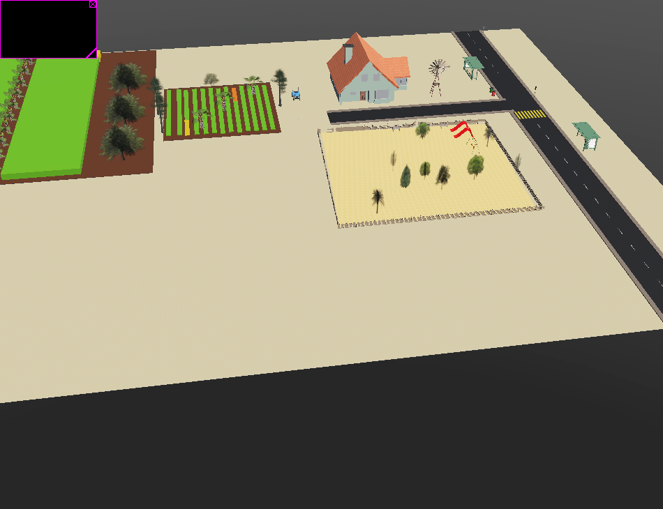

# Agrocopter

#Product Backlog (Sprint 1: 14/9 - 17/9)

1. GitHub Repository - Harshal Sharma

  a) Create Git repository on GitHub 
  b) Ensure all members accept invitation, can access and modify repository
  c) Uploading Sprint 1

2. Design model of farm - Manmeet Marwaha, Dilpreet Singh

  a) Identify elements relevant to the farmland for this project
  b) Explore resources inside webots and identify useful resources
  c) Design the model of a farmland that can be used to test the functionality of the drone
  d) Implement the features of farmland in world file

3. Explore Webots and find resources for the drone - Everyone
  a) Become more familiar with webots
  b) Explore and research new ways to strengthen idea 
  c) Select a drone from webots

#Product Backlog (Sprint 2: 18/9 - 25/9)

1. Implement model of farm and push to GitHub - Dilpreet Singh, Manmeet Marwaha
 
  a) Work on the designs thought in the last spring
  b) Implement those in the farmland
  c) Push the resulting outcome on GitHub

2. Add sensors to Webots - Kinshuk Jain, Harshal Sharma, Anshu Nagpal

  a) Study the project deeply to know which sensors to be added
  b) Know more about the sensors decided
  c) Add the sensors to the world by adding them in nodes

3. Initiate the controller work for drone - Harshal Sharma, Kinshuk Jain, Anshu Nagpal

  a) Think about the functionality of drone and idenitify a programming language suitable for every team member
  b) Gather exmples of controllers from webots
  c) Create DJ Mavic 2 pro controller in decided language

4. GitHub Repository
  a) Add product backlog, sprint 2 to README.md - Harshal Sharma
  b) Add screenshot of farmland - Manmeet Marwaha

#Product Backlog (Sprint 3: 26/9 - 29/9) 

1. Find and study resources for drone controller - Anshu Nagpal, Kinshuk Jain, Harshal Sharma

  a) Identify and note every functionality in drone
  b) Find and study resources to make it fly autonoumously

2. Work on controller and make it fully functional - Anshu Nagpal, Harshal Sharma, Kinshuk Jain

  a) Study steering behaviours to make it follow a certain path in field
  b) Find different methods for drone to fly ove rthe field
  c) Design the controller for each functionality and implement the autonomous flying capability along with the live view of drone’s camera on screen

4. GitHub Repository
  a) Add Sprint 3 to README.md - Harshal Sharma
  b) Update screenshot of farmland - Manmeet Marwaha

#Product Backlog (Sprint 4: 30/9 - Final Sprint) (DEPENDS ON SPRINT 3)

1. Combine elements and make the code work functionally - Kinshuk Jain, Harshal Sharma, Anshu Nagpal

  a) Add the required code for sensors
  b) Combine the code ofr sensors into the controller code
  c) Test that it fucntions properly when added together

2. Test and Debug - Everyone

  a) Run and code and test it under different circumstances
  b) Fix any bugs visisble
  c) Spontaneous bonus additions after completion

3. GitHub Repository - Harshal Sharma
  a) Add Sprint 4 to README.md 
  b) Update screenshot of farmland 

